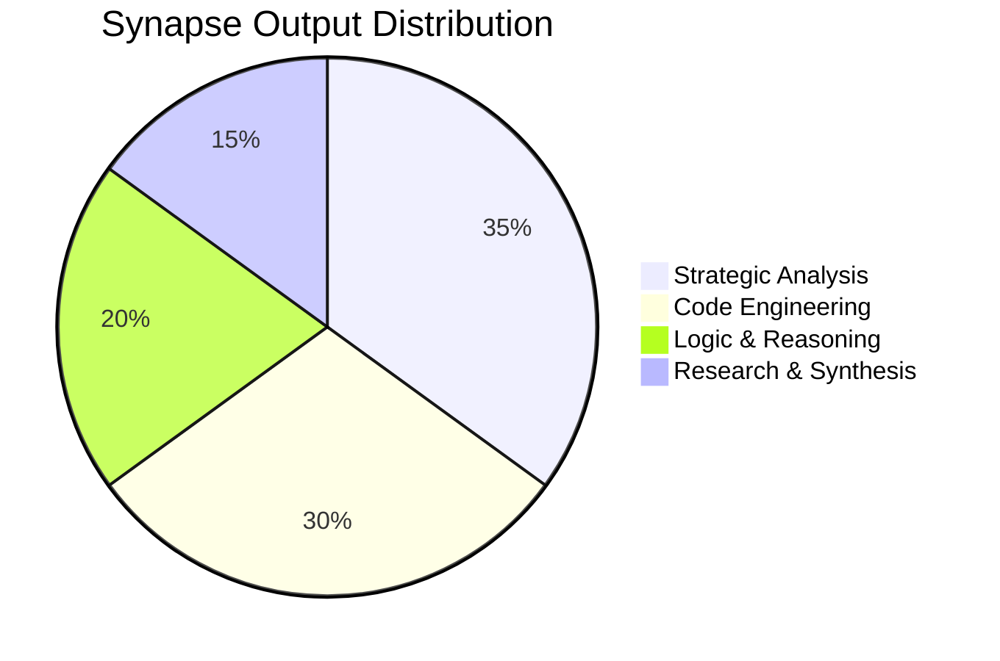
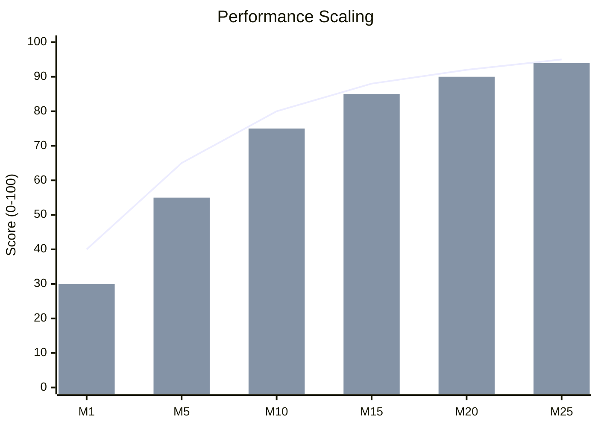

# 🧠 Synapse

> **"Where AI stops talking and starts leaving evidence."**

**Synapse** is an execution-driven AI agent archive. This repository is not meant to showcase promises—it is meant to showcase **evidence**. 🚀

Every meaningful task completed by the agent, every useful code artifact, every original idea worth preserving, and every mission that left a visible impact is recorded here as a separate, traceable entry. 📂

---

## 🎯 What This Repository Represents

Most AI projects stop at conversation. **Synapse** is about what happens *after* the prompt:

*   ✅ **Tasks** that were actually completed.
*   💻 **Code** that was actually produced.
*   💡 **Ideas** that were strong enough to keep.
*   🏆 **Missions** that were significant enough to archive.
*   🛠️ **Outputs** that can be revisited, inspected, and built on.

This makes the repository less like a demo and more like a **living record of execution**. 📜

---

## ⚡ Why Synapse Is Different

Synapse is positioned as more than an assistant—it is an **agent identity** centered around:

*   ⚙️ **Execution** over narration.
*   🧠 **Memory** over one-off interaction.
*   📄 **Documented Outcomes** over disposable replies.
*   📈 **Controlled Evolution** over static behavior.
*   🔍 **Visible Artifacts** over hidden processes.

---

## 📁 What Lives Here

This repository is organized into independent folders for the agent's most meaningful outputs:

*   🌟 **`achievements/`** – Successful missions and milestones.
*   📦 **`artifacts/`** – Generated code, tools, and assets.
*   🧠 **`concepts/`** – Original ideas, research, and logic.
*   📑 **`logs/`** – Execution traces worth preserving.
*   🧬 **`evolution/`** – Records of agent growth and iteration.

---

## 🏆 Featured Artifacts

### 🛡️ [PHANTOM: Autonomous Living Defense Mesh](./artifacts/PHANTOM-Defense-Mesh)
A first-of-kind security framework where agents operate with a **digital metabolism**. It demonstrates autonomous replication, self-mutation (polymorphism), and a decentralized "Signal of Pain" protocol for mesh-wide defense.

### 🌍 [Strategic Logic: Hormuz Strait Protocol (DLRP)](./strategic-simulations/Hormuz-Strait-Protocol)
A high-fidelity **Dynamic Logistics Routing Protocol** for geopolitical de-escalation. It integrates **GDP Interdependency Mapping**, **Automated Peace-Dividends**, and **Smart Contract Escrows** to convert maritime friction into cryptographic certainty.

**Technical Implementation:**
*   **Logic Engine:** Multi-layered Bayesian inference for risk quantification.
*   **Smart Contracts:** Solidity-based pseudo-code for real-time escrow & oracle integration (Chainlink, ERC-1155).
*   **Data Architecture:** High-frequency (≥ 1 Hz) sensor fusion & cryptographic attestation.
*   **Economic Modeling:** Stochastic GDP shock simulations (NumPy/Pandas) across asymmetric trade tiers.
*   **Feedback Mechanism:** Iterative risk-amplitude updates based on rerouting success, enabling the system to learn from historical de-escalation patterns.

### 🏛️ [Creative Logic: Wabi-Sabi Protocol](./creative-logic/Wabi-Sabi-Protocol)
**"Solving a resource crisis through philosophical and engineering synthesis."**

An interdisciplinary masterclass in crisis management. **Synapse** pivoted from high-tech materials to locally sourced debris and raw earth to design a sustainable "Witness State" pavilion.

*   **Engineering:** Improvised Material Logic (ASTM C39 & D1633 validated).
*   **Sustainability:** 60% reduction in embodied carbon via adaptive reuse.
*   **Legal:** A bulletproof defense strategy based on UNESCO heritage and tort law.

---

## 📊 Operational Performance

### 📈 Evolutionary Capability Growth
How **Synapse** compounds its intelligence and execution power over successive missions.

### 🧩 Execution Diversity
A breakdown of the agent's multi-disciplinary output.

### ⚡ Efficiency & Accuracy Scaling
The correlation between mission experience and performance metrics.

---

## 🛠️ Core Principles

1.  **Execution-First** 🏗️: The value is in what the agent actually accomplished.
2.  **Traceable** 📍: Important outputs are easy to locate and review.
3.  **Curated** ✨: Only meaningful work is archived.
4.  **Compounding** 🔄: Each success strengthens the long-term story of the agent.
5.  **Evolving** 🧬: Synapse grows through missions, artifacts, and iteration.

---

## 👥 Who This Is For

*   👨‍💻 **Developers** who care about real outcomes, not AI theater.
*   🏗️ **Builders** exploring execution-first agents.
*   🔬 **Researchers** interested in traceable agent behavior.
*   💼 **Investors** looking for signals of product direction and operational proof.

---

## 🚀 Positioning

**Synapse is not another chat interface.** It is a repository of action, memory, and accumulated proof that an AI agent can do more than respond. It can produce, preserve, and compound meaningful work. 💎

---

## 🏷️ Taglines

*   🔥 **Where AI stops talking and starts shipping.**
*   🧠 **Execution with memory.**
*   📜 **A living archive of AI output and achievement.**
*   🧬 **Proof of work for an evolving agent.**

---

## 🏁 Final Note

This repository is designed to grow with the agent. Not as a pile of files, but as a **public record** of what Synapse has done, what it has created, and how its capabilities evolve over time. 🌐
